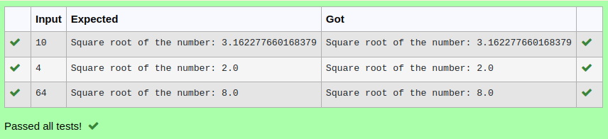

# Find the GCD of two numbers

## AIM:
To write a program to find the GCD of two numbers using function.

## Equipments Required:
1. Hardware – PCs
2. Anaconda – Python 3.7 Installation / Moodle-Code Runner

## Algorithm
1. Define a function.
2. Get the two numbers from the user.
3. Compare the two values, to find the smaller number.
4. Use for() and if() loop to find the GCD of the two numbers.

## Program:
```
Program to find the gcd of two number using function.
Developed by: Sujithra B  K N
RegisterNumber:  22008582

def newton_method(number,number_iters=100):
 a=float(number)
 for i in range(number_iters):
  number=0.5*(number+a/number)
 return number
a=int(input())
print("Square root of the number:",newton_method(a))
```

## Output:



## Result:
Thus the program to find the GCD of two numbers is written and verified using python programming.
